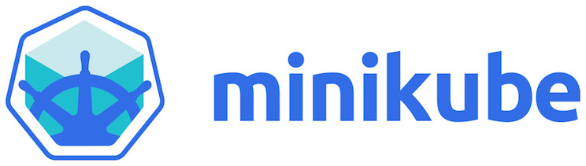

# minikube-lessons



## Install

### Minikube
```shell
curl -Lo minikube https://storage.googleapis.com/minikube/releases/latest/minikube-linux-amd64 && chmod +x minikube && sudo mv minikube /usr/local/bin/
```

### Kubectl

```shell
curl -LO https://storage.googleapis.com/kubernetes-release/release/$(curl -s https://storage.googleapis.com/kubernetes-release/release/stable.txt)/bin/linux/amd64/kubectl
chmod +x ./kubectl
mv ./kubectl /usr/local/bin/kubectl
```

### Enabling shell autocompletion

```shell
apt-get install bash-completion
echo "source <(kubectl completion bash)" >> ~/.bashrc
```

## Comandos de minikube

```shell
minikube stop/start/delete/status
minikube dashboard # habilita el dashboard
minikube service ejemplo-nginx # abre web del servicio
minikube ssh # entra en el nodo
```


## Use local images in minikube
So to use a image without uploading it you can follow these steps:

- set the environment variables with eval ```eval $(minikube docker-env)```
- build the image with the Docker daemon of Minukube (eg docker build -t my-image .)
- set the image in the pod spec like the build tag (eg my-image)
- set the **imagePullPolicy** to Never, otherwise Kubernetes will try to download the image
- update deployment ```kubectl set image deployment/nginx-deployment nginx=prueba:1```

kubectl set image deployment/nginx-deployment nginx=jorgeandrada/nginx-autoindex

minikube service webserver

curl -sSL $(minikube service --url webserver)

docker build -t test:latest .
kubectl set image deployment/nginx-deployment nginx=nginx:alpine
kubectl set image deployment/nginx-deployment nginx=test
docker build -t test:v2 .
kubectl set image deployment/nginx-deployment nginx=test:v2
